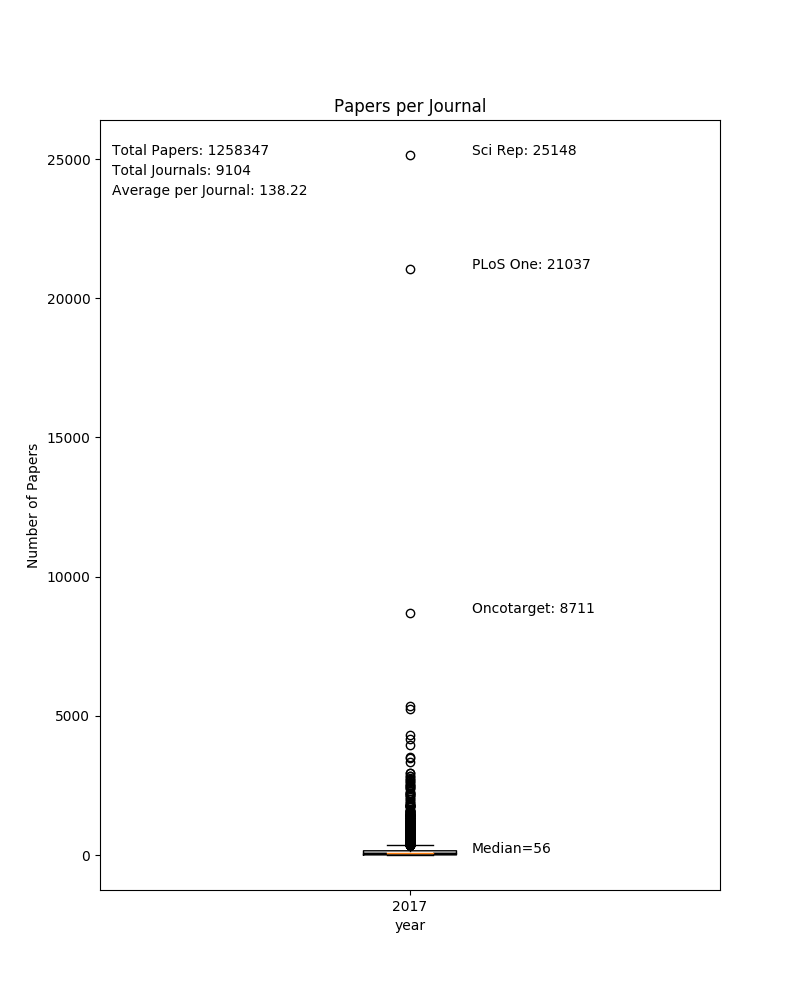
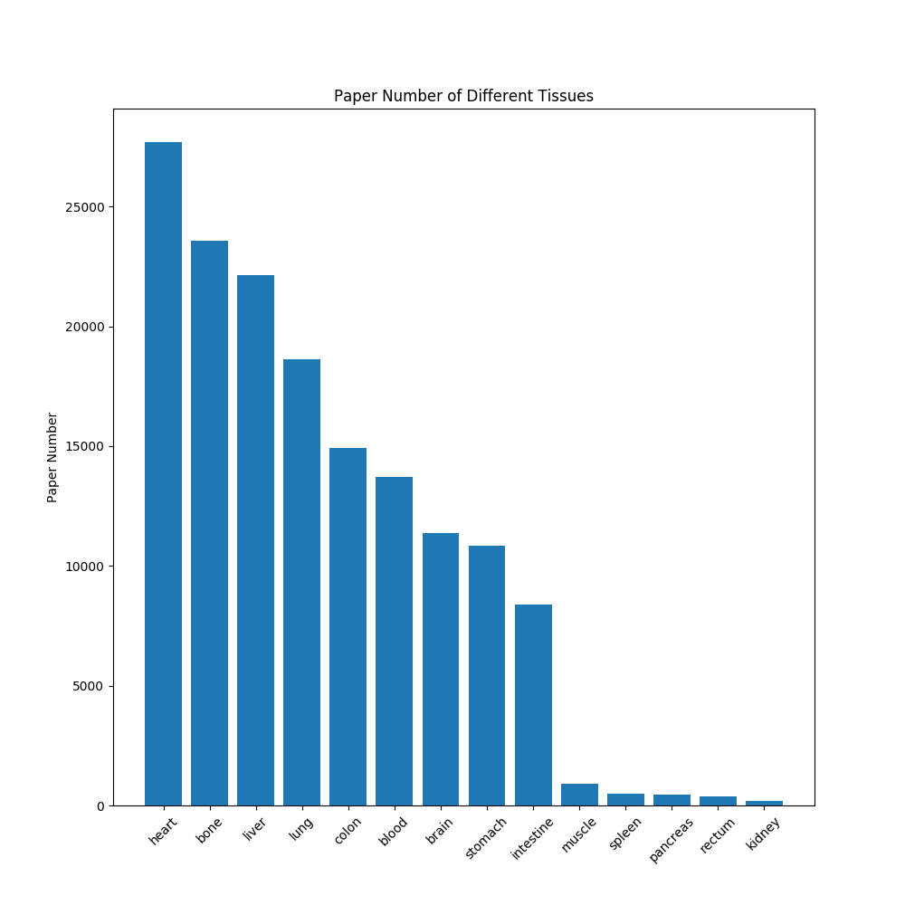
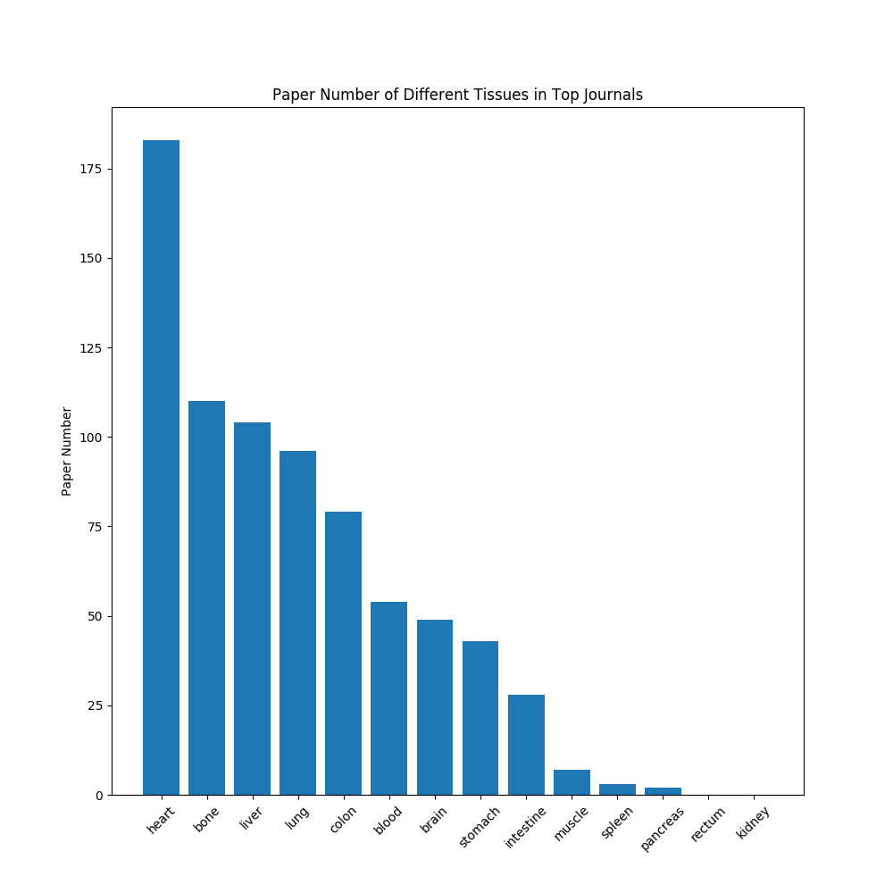
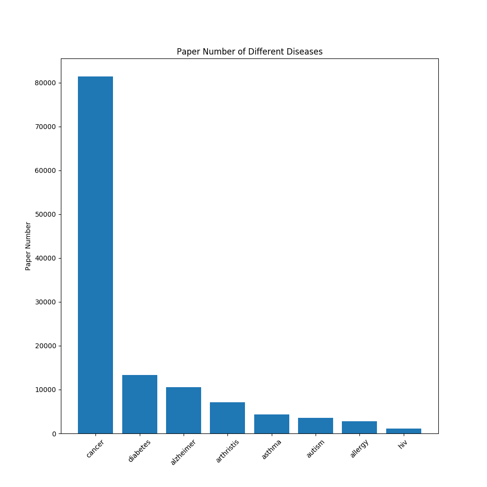
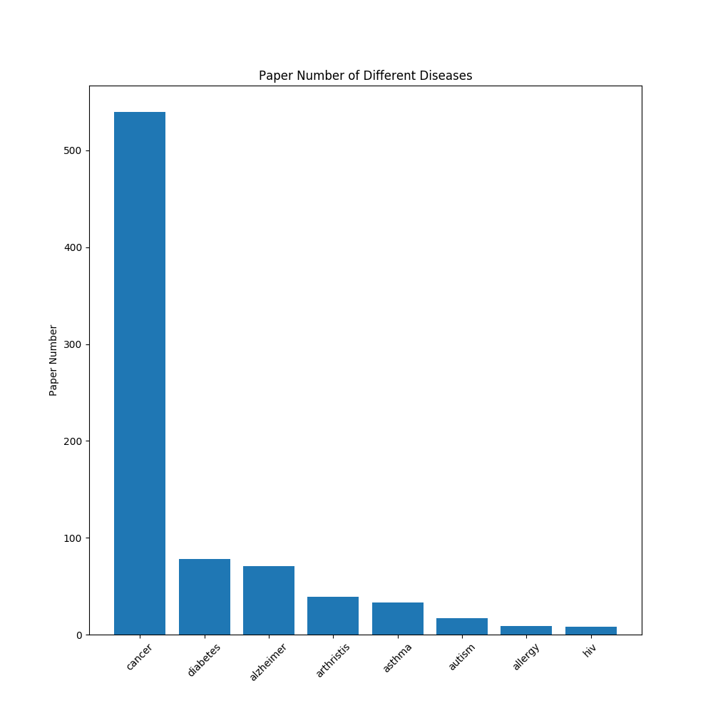
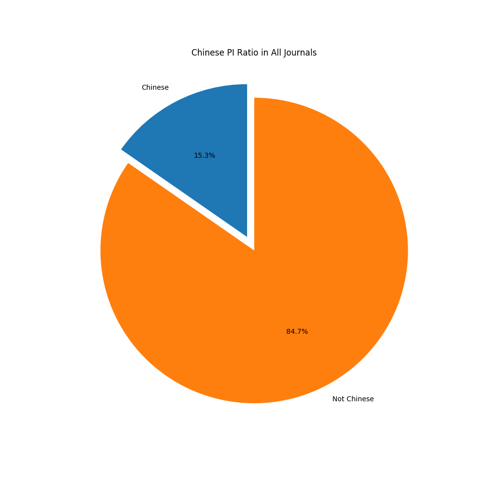
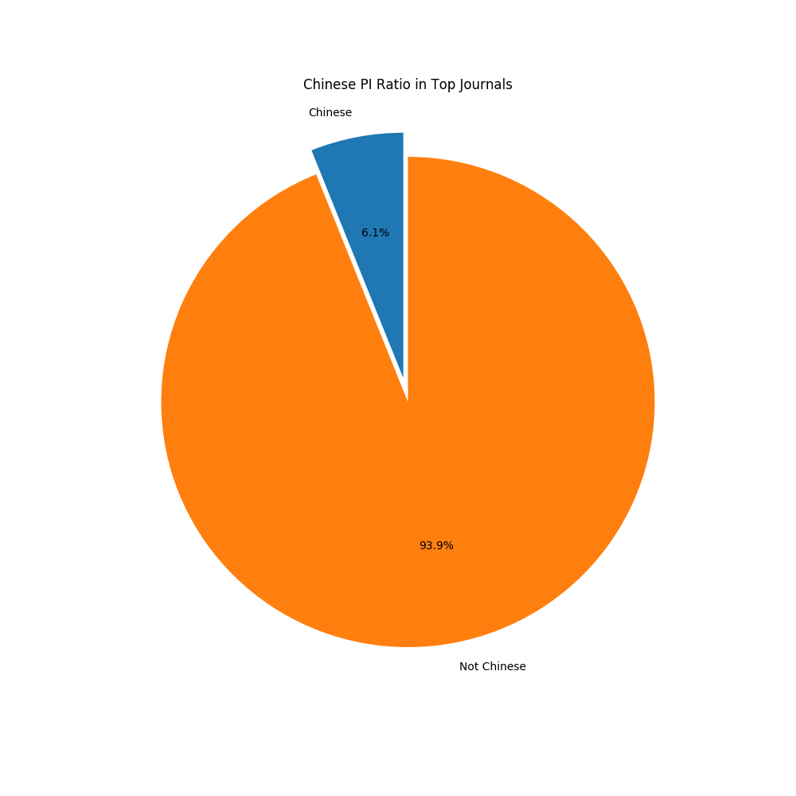
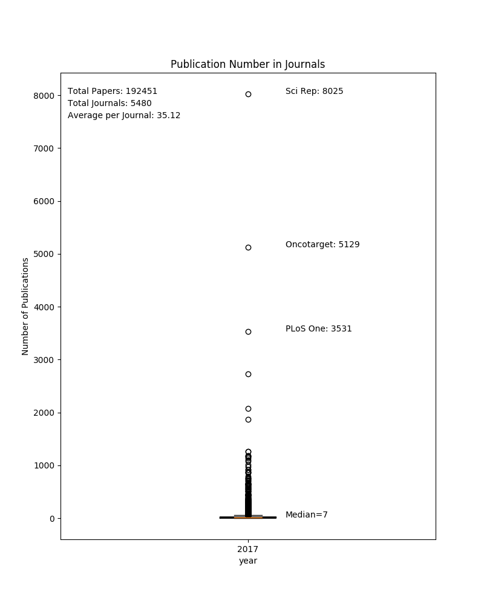
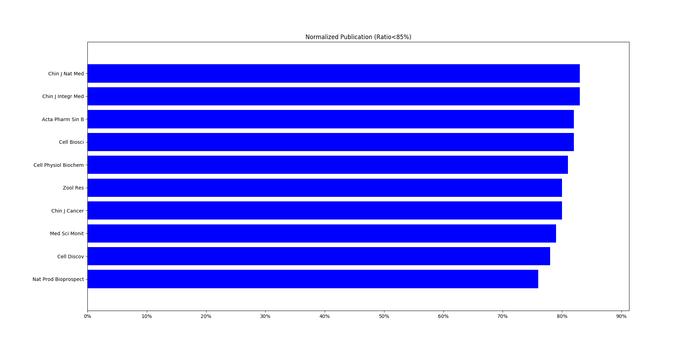
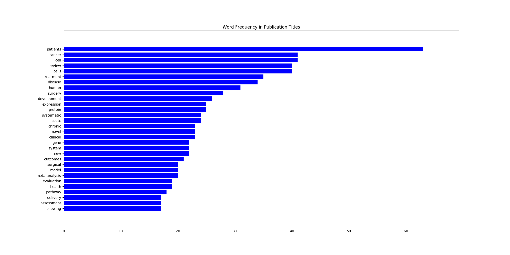

## Analyze Pubmed Records  

* ### Download Data from Pubmed
download publication records from 2017-01-01 to 2017-12-31 (publication date) as csv file.   

* ### Raw Data (2017.csv)
Raw csv file has 1292498 rows.  

* ### Clean the Data  
 1. Remove multiple headers;
 2. Strip 'Title';
 3. Remove null in 'Description';
 4. Remove duplicates.

* ### Count Total Publications per Journal
  

* ### Total Publications with Tissue Keywords in Title  

* ### Top Journal Publications with Tissue Keywords in Title  

* ### Total Publications with Disease Keywords in Title  

* ### Top Journal Publications with Disease Keywords in Title  

* ### Chinese Corresponding Authors Ratio in All Publications 
* #### Note: Whether the corresponding author of a publication is Chinese is determined by his/her last name 

* ### Chinese Corresponding Authors Ratio in Top Journal Publications (IF>20)  

* ### Journals Published Most Studies from Chinese Corresponding Authors  

* ### Journals Published Most Studies from Chinese Corresponding Authors (Normalized, and Ratio<85%)  
* #### Notes: Most of the Journals with >85% Publications by Chinese Corresponding Authors are Chinese Journals

* ### Most Frequent words in Publication Titles (use 1000 records, and filtered with words blacklist)  
* #### Note: I tried to run the same script on whole dataset, but it took too much time to finish the task.

